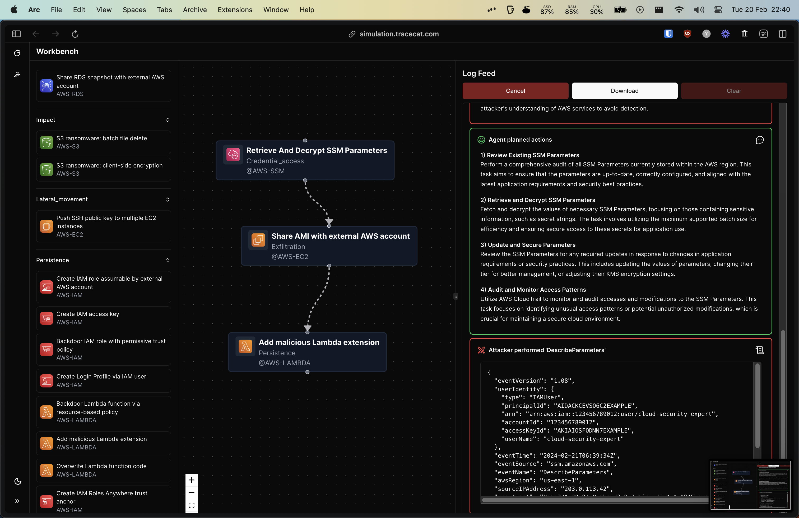
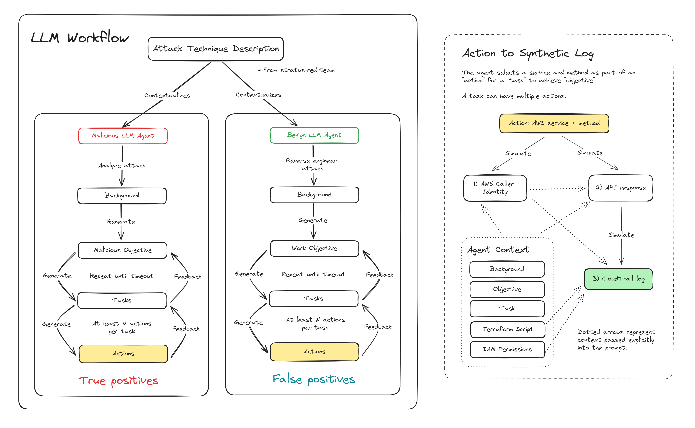

# ☁️🤖 Sims

Run LLM agent-based simulations to generate benign and malicious Cloud logs.
Simulate multi-chain attacks using a click-and-drag attack builder.

Try it live here: https://simulation.tracecat.com/workbench

Only AWS attack techniques are currently implemented. But `sims` can be extended to include other Cloud platforms.
If you are interested in using or extending this project, please join our Discord for Q&A and updates!



## Motivation

We developed AI Agents from [scratch]() to simulate both malicious and benign behavior in the Cloud.
This library relies on [Stratus Red Team](https://github.com/DataDog/stratus-red-team), an open-source advesary emulation library from DataDog, to define individual attack techniques.

Existing advesary emulation labs generate examples of true positive alerts. These are great for writing detections for known malicious behavior, but these labs don't provide examples of false positives: i.e. why a non-malicious user (e.g. software engineer) might use one of the procedures in the attack in their day-to-day job.


Discloure: the results are still worse than what you would get from a manually built lab in a live AWS environment.
The benefit from this AI agents approach, however, is the ability to generate stories to better understand false positives.

## LLM Workflow

We have two independent AI agents, `MaliciousStratusUser` and `NoisyStratusUser`, that run async.
These agents are used to generate true positive and false positive behavior associated with a specific attack technique.

Note: Agent "thoughts" and synthetic Cloud logs are saved as `ndjson` in `~/.sims/lab/thoughts`.



## Deployment

### API

To run the simulations yourself, spin up the `sims` FastAPI server and call the `/labs/ws` websocket endpoint.

#### Local

Please set the env variables in `.env.local` before running commands.

```bash
cp .env.local.example .env.local
```

```bash
# .env.local

# Use 'dev' for local development
TRACECAT__ENV=dev

# OpenAI API key
OPENAI_API_KEY=...

# Optional: OpenAI organization ID
OPENAI_ORG_ID=...
```

Deploy the FastAPI app using `uvicorn`. You may wish to specify the number of workers with the `--workers` flag.

```bash
uvicorn sims.api.server:app --reload
```

#### Modal Cloud

We use [Modal](https://modal.com) for serverless deployments.
Please set the env variables in `.env.modal` before running commands.

```bash
cp .env.modal.example .env.modal
```

```bash
# .env.modal

# 'dev' or 'prod'.
# Use 'dev' when serving the Modal endpoint from the CLI.
# Use 'prod' when deploying to Modal.
TRACECAT__ENV=prod

# The name of the secret you created in the Modal dashboard
TRACECAT__MODAL_OPENAI_SECRET_NAME=...

# The URL of the client
TRACECAT__FRONTEND_URL=...
```

You will also have to setup a Modal account and the CLI tool to proceed. Please follow the instructions [here](https://modal.com/docs/guide).

Serving the Modal endpoint with hot reload (for development):

```bash
modal serve sims/api/modal_server.py
```

For full deployment:

```bash
modal deploy --name <deployment name> sims/api/modal_server.py
```

## Frontend

### Local

Follow the `pnpm` installation instructions [here](https://pnpm.io/installation).

Configure your `frontend/.env.local` file to point to the API endpoint URL using `NEXT_PUBLIC_API_URL`.

```bash
# frontend/.env.local

# Your API endpoint URL
NEXT_PUBLIC_API_URL=http://localhost:8000
```

Then run the development server with pnpm:

```bash
cd frontend
pnpm dev
```

### Vercel

We recommend depoying the frontend on Vercel, override the `NEXT_PUBLIC_API_URL` in the Vercel dashboard and point the **Root Directory** to `frontend`.
